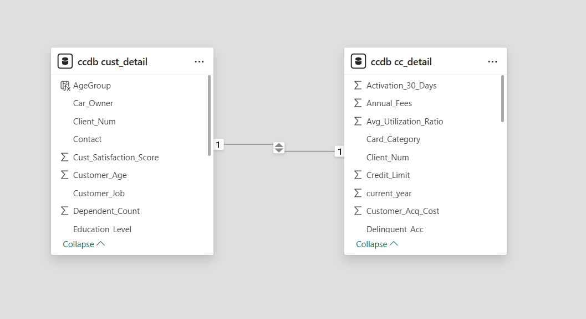

# Data Model

# Overview

The Credit Card Financial Dashboard follows a **Star Schema** data model, which is the recommended modeling approach for Power BI.

The model consists of one **Fact Table** containing transactional and financial metrics, and one **Dimension Table** containing customer demographic information.

The relationship between these tables enables efficient filtering, simplified DAX calculations, and improved report performance.

---

# Data Model Diagram

> **Note:** Refer to **Images/Data_Model.png** for the complete relationship diagram.



---

# Data Model Architecture

```
                    customer.csv
                  (Dimension Table)
                          │
                          │
               Client_Num (1)
                          │
                          │
               Client_Num (*)
                          │
                          ▼
                 credit_card.csv
                   (Fact Table)
```

---

# Tables Used

## 1. customer.csv (Dimension Table)

This table stores descriptive information about each customer.

### Key Attributes

- Client_Num
- Customer_Age
- Gender
- Education_Level
- Marital_Status
- Customer_Job
- Income
- State
- Customer Satisfaction Score
- Dependent Count

### Purpose

This table is used for customer segmentation and demographic analysis.

Examples include:

- Revenue by Gender
- Revenue by Age Group
- Revenue by Education
- Revenue by Occupation
- Revenue by State
- Revenue by Income

---

## 2. credit_card.csv (Fact Table)

This table stores transactional and financial measures.

### Key Metrics

- Revenue
- Interest Earned
- Transaction Amount
- Transaction Count
- Annual Fees
- Customer Acquisition Cost
- Credit Limit
- Revolving Balance
- Utilization Ratio

### Purpose

This table captures measurable business events and supports financial and transaction analysis.

Examples include:

- Quarterly Revenue
- Revenue by Card Category
- Revenue by Expenditure Type
- Revenue by Transaction Method
- Customer Acquisition Cost
- Interest Earned

---

# Relationship

| Property | Value |
|----------|-------|
| Parent Table | customer.csv |
| Child Table | credit_card.csv |
| Relationship Column | Client_Num |
| Cardinality | One-to-Many (1:*) |
| Cross Filter Direction | Single |
| Relationship Status | Active |

---

# Why Star Schema?

A Star Schema was selected because it is the recommended data modeling approach for Power BI and Business Intelligence solutions.

### Benefits

- Faster query execution
- Simplified DAX calculations
- Reduced model complexity
- Better scalability
- Easier maintenance
- Improved report performance

Compared to a Snowflake Schema, the Star Schema requires fewer joins and provides a simpler structure for analytical reporting.

---

# Fact Table vs Dimension Table

## Fact Table

The **credit_card.csv** dataset acts as the Fact Table because it contains measurable business metrics.

Examples:

- Revenue
- Interest Earned
- Transaction Amount
- Transaction Count
- Annual Fees

Fact tables answer:

> "What happened?"

---

## Dimension Table

The **customer.csv** dataset acts as the Dimension Table because it provides descriptive attributes about customers.

Examples:

- Gender
- Education
- Job
- Income
- Marital Status

Dimension tables answer:

> "Who, What, Where, and Why?"

---

# Filter Flow

The dashboard uses **single-direction filtering**.

```
customer.csv
      │
      ▼
credit_card.csv
```

When users select a customer attribute such as:

- Gender
- Education
- Occupation
- State

Power BI filters the related transaction records in the Fact Table, ensuring consistent and efficient calculations.

---

# Data Granularity

The Fact Table stores data at the **customer-week transaction level**, where each record represents the financial and transactional metrics for a customer during a specific reporting week.

This level of granularity supports:

- Weekly analysis
- Quarterly trends
- Customer-level analysis
- Revenue analysis
- Transaction behavior analysis

---

# Data Modeling Best Practices

The following best practices were followed while designing the data model:

- Adopted a Star Schema for analytical reporting.
- Maintained a clear separation between Fact and Dimension tables.
- Used a single active relationship between tables.
- Linked tables using a unique customer identifier (Client_Num).
- Minimized model complexity by avoiding unnecessary relationships.
- Used descriptive dimension attributes for slicing and filtering.
- Built reusable DAX measures on top of the model.

---

# Business Impact

The data model enables stakeholders to:

- Analyze customer behavior across multiple demographic dimensions.
- Compare financial performance across customer segments.
- Perform dynamic filtering without compromising report performance.
- Generate reliable KPIs using reusable DAX measures.
- Support scalable and maintainable dashboard development.

---

# Summary

The Power BI data model provides a scalable and efficient foundation for the Credit Card Financial Dashboard. By implementing a Star Schema with a single active relationship between customer and transaction data, the model enables fast performance, intuitive analysis, and simplified business reporting.
